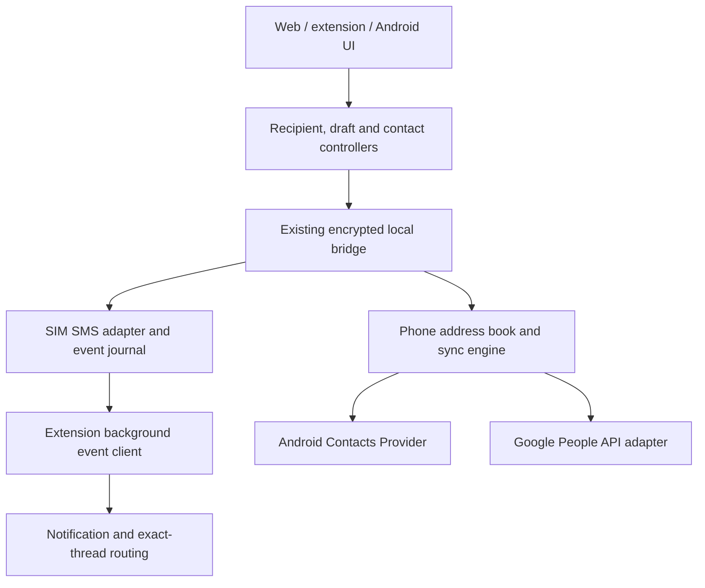

# Voiceish SIM: proposed architecture

1. Keep the chosen recipient's name and actual destination number visible throughout composing.
2. Receive background notification previews even with the popup and messaging page closed, while Chrome and the phone bridge are running.
3. Provide one address book linking received numbers, Android contacts and Google Contacts, with optional two-way synchronization.
4. Preserve the existing local-network boundary, SIM pinning, encryption and uncertain-send safeguards.
5. Freeze this proposal and its recipe only after operator sign-off. No product implementation is authorized by this draft.

## 1. Evidence and scope

The correct lineage is `rebots-online/voiceish-complete-0.1.4`, the SIM app from the 16 September project. It is not the older VoIP.ms/reseller project. The recovered complete bundle includes native Java Android sources, an MV3 Chrome extension, shared direct-browser engine, standalone web export and build/package scripts. The extension within that 0.1.4 bundle has manifest version **0.2.2**; never manufacture a new product version to hide this distinction. Root release packaging and source documentation currently disagree on some extension filenames; reconcile through version metadata, not ad hoc renames.

Inspected facts:

- `source/web/dist/style.css`: workspace uses `100dvh` plus `min-height:580px`. This is a likely contributor to keyboard/short-window clipping; the precise failing device geometry remains to be reproduced.
- `source/web/dist/index.html`: composer does not repeat recipient identity beside the input.
- `source/web/dist/app.js`: refresh interval is 15 seconds and runs only when the page is visible.
- `source/extension/popup.js`: refresh every 5 seconds while popup is visible.
- `source/extension/manifest.json`: storage permission only; no notification or alarm capability.
- `source/extension/background.js`: request-driven refresh/send, no independent inbound subscription.
- `source/docs/PROTOCOL.md`: current v1 actions are status, messages and send; snapshots are capped. No contacts capability.
- Native manifest requests SMS/phone/bridge notification permissions, but no contacts permission.

The screenshots and reported behavior are the operator's defect report. Source inspection establishes missing features, not a physically reproduced fix. No APK or extension source was changed for this review.

## 2. Requirements and acceptance boundaries

| ID | Requirement | Observable acceptance |
|---|---|---|
| R01 | Recipient remains visible | Name and full number appear in header and composer at 320px width, 200% text zoom, keyboard open and short popup heights; Send's accessible name includes the number. |
| R02 | Background text previews | With popup/site closed, a new inbound SMS shows sender/number/body preview; click opens the exact device/SIM/number thread. Test denial, DND, sleep and reconnect. |
| R03 | Save one received number | Unknown thread offers Add new and Link existing; destination and field preview precede provider mutation. |
| R04 | Add all received numbers | Page through all available inbound provider history for pinned SIM; unique canonical addresses are reviewed, with coverage/progress, exclusions and unresolved numbers visible. |
| R05 | Android contacts | Import/lookup from chosen accounts, preserve all numbers and labels, optional writes to writable raw contacts. Denial does not break texting. |
| R06 | Google Contacts | Chosen-account import/lookup and optional create/update/delete, with real OAuth, revocation and expiration states. |
| R07 | Formatting and identity | Country-aware canonical numbers link punctuation, spaces and valid national/international equivalents; ambiguous inputs and shared numbers never merge silently. |
| R08 | Two-way sync | Edits observed on either source reach the linked identity; opted-in writes reach writable providers; repeated cycles make no duplicate records or echo loops. |
| R09 | Safer onboarding | Scan phone QR using desktop camera, compare device/SIM/phrase, verify reachability before success. Advanced fallback remains explicit. |
| R10 | Preserve transport and send semantics | Current subnet restriction stays; send IDs remain idempotent; unknown never auto-resends; no SIM/account fallback. |
| R11 | Review and orchestration | Coherent linked prototype, metadata-rich architecture and atomic recipe; kstore-first retrieval, exact sign-off hashes, one requested worker/task, verified saving. |

R07 does not mean every arbitrary text can be converted to a dialable number. Short codes, alphanumeric senders, service codes and extensions retain their original identity and explicit capabilities. Linking a contact never grants permission to send to an invalid address.

## 3. Components and data ownership

The **phone** is the authority for the operator's local Voiceish contact identities, source mappings, change journal and sync outbox. Desktop clients hold derived contact indexes plus per-thread drafts, rather than independently writing to Google or Android. Android and Google remain authorities for their respective source records. Voiceish maintains a versioned merged view and explicit proposed edits; it does not replace provider ownership.

kstore is the authority for this project's specifications, sign-off, execution receipts and durable decisions. It is not the end-user runtime's SMS/contact database. Do not upload real contacts or message bodies into kstore or design services as test evidence.

### UI modules

- `RecipientController`: immutable resolved `RecipientRef` per draft/send attempt; updates require explicit number selection.
- `ThreadRepository`: keys by device, pinned SIM and canonical address, independent of a contact's editable name.
- `DraftRepository`: restore by thread key; recipient changes cannot move draft text implicitly.
- `NotificationRouter`: routes notifications by thread ID, not current selection.
- `ContactController`: lookup, create, link, import, bulk review, edit and source destination preview.
- `SyncController`: policy, queue status, field changes, conflicts, deletion review and unlink.
- `ViewportController`: browser visual viewport and native keyboard insets; one layout source.

Keep native Java and current dependency-light JS surfaces. Do not rewrite in React, Tauri or a new hosted platform solely for this change. Prototype HTML is a behavioral/layout reference; export adapted views into existing source modules and regenerate the standalone HTML through its current script.

## 4. Layout and navigation

Use a layout grid with separate header, history and composer rows. Only history scrolls during typing. Header and composer show both the chosen name and full destination, with wrapping and no ellipsis. The composer includes SIM identity and availability. Remove global minimum heights that exceed available viewport height. On mobile, one main pane at a time, with Back to messages.

Opening a different thread saves the current draft under its thread key, resolves the new `RecipientRef`, then restores the new draft. A selected contact's name can update after sync; the draft's actual chosen destination cannot change with it. A changed/deleted phone number flags the draft for review; it never reroutes an in-flight send.

The HTML and `screens.json` cover 31 linked views/states: onboarding and permissions; scan/fallback/confirmation; connection check; notification setup/test/blocked; inbox; conversation/new recipient/multiple numbers/uncertain send; unknown sender; address book/details/edit/add/link/bulk; Android/Google imports and review; sync policy/outgoing review/conflict; denied contacts/expired Google/offline. The review selector can reach every state independently. The Figma Design companion has editable layers and native navigation links; dynamic input/state changes are demonstrated in HTML.

## 5. Pairing without a long copied string

Preserve phone-hosted local transport. Primary redesign: desktop scans a phone-displayed, short-lived pairing QR. This is the same transfer direction as the existing pairing material, using optical scanning instead of copying. It is not a claim to reproduce MightyText's account/relay architecture. A phone-scans-desktop-only flow would require browser-reachable rendezvous/discovery not currently supplied by v1; do not silently introduce such infrastructure.

Add an ephemeral challenge/public-key exchange and phrase comparison before establishing the persistent shared key. QR includes protocol version, phone-local endpoint, session ID, expiration, nonce and ephemeral public key. It must not expose the permanent pairing key. Challenge frames, key derivation and phrase generation require reviewed standard primitives, test vectors and explicit session/endpoint binding. Existing v1 pairing import remains an advanced compatibility path with its current secret-handling rules.

Desktop camera permission is just in time. A computer without a camera gets clearly labeled file/code import, not a broken default flow. Scan success is not connection success: require authenticated phone response, confirmed SIM, explicit operator comparison and then successful status/messages capability check. Explain local reachability errors without changing the subnet listener or adding a relay.

## 6. Background incoming events and notifications

Add capability-negotiated v2 event delivery on the existing phone host/port, alongside v1 RPC. Preferred path: WebSocket upgrade at `/v2/events`; app-level AES-GCM frames with a distinct event AAD, paired session and monotonically sequenced event IDs. No SMS/contact payload is sent before authenticated subscription; close unauthenticated sockets promptly. Pairing identity, SIM and event epoch bind each connection. Never reuse nonces across directions/actions.

Android observes the SMS provider while the existing remoteMessaging bridge is active. Use provider changes plus a bounded incremental rescan to create durable inbound event metadata; multipart arrivals must resolve into one provider message event. Initial enrollment seeds a baseline without notifying for historical inbox content. `messages.page` provides historical paging, separate from `events.page` catch-up. Journal retention and watermarks are explicit; stale cursor returns a typed gap, with a bounded reconciliation path and coverage warning.

Extension service worker owns the subscription even when the popup/page is closed. Encrypted heartbeat interval 20 seconds while live; reconnection uses `chrome.alarms`, exponential backoff with cap and jitter, recreated on startup. `alarms` and `notifications` permissions are added with clear setup text. The 30-second alarm minimum is a fallback/reconnect constraint, not a claim of immediate polling notifications. Prefer socket events; characterize actual latency on the phone. Browser exit, OS sleep and unavailable bridge prevent immediate delivery.

Persist event cursors and dedup keys in trusted extension storage. Serialize cursor advance, pending event metadata and notification outcome; deterministic notification IDs make retries replace the same OS item. Exactly-once visible OS delivery cannot be guaranteed across an arbitrary crash between side effect and acknowledgement; avoid duplicates in normal reconnect/restart tests and record uncertain notification outcomes honestly. Seed historical enrollment separately. No permanent full inbox cache is required; keep preview bodies ephemeral and clear queued transient content after display.

Notification presentation: resolved name (or Unknown sender), full number, preview, SMS SIM and timestamp. Previews are enabled when the operator enables notifications, with an option to hide message content. Clicking focuses/opens a controlled extension tab for the exact thread; it must not send a reply. Denied Chrome notifications keep badge/unread/in-app preview. OS DND may suppress popups despite granted API permission; test notification and a user-visible check are necessary. A direct standalone webpage cannot reliably receive this local socket while its page is closed; background delivery requires the installed extension. Open direct pages may display in-app previews; setup must describe this capability boundary.

## 7. Address book schema

| Entity | Required fields |
|---|---|
| Contact | `id`, `displayName`, `revision`, `createdAt`, `updatedAt`, `deletedAt?` |
| PhoneAddress | `id`, `rawValue`, `canonicalValue?`, `region?`, `kind`, `extension?`, `parseStatus`, `label`, `canSendSms` |
| ContactAddressLink | contact/address IDs, preferred flag, operator-confirmed/shared-number marker |
| SourceRecord | provider, account identity, resource/lookup key, raw-contact ID where applicable, source version/etag, writable flag, last fetched snapshot |
| SourceLink | contact ID, source record ID, mapping confidence, field provenance, write owner, last synced field values/hashes |
| ContactChange | operation ID, base revision, field patch, origin source, timestamp, approval reference |
| SyncOperation | target source, expected version, payload hash, state, attempts, error code, retryAt, dependency/echo marker |
| SyncConflict | contact/field, base value, provider values, proposed result and resolution |
| ThreadRef | device ID, pinned subscription ID, address identity; optional linked contacts |

Source identifiers are account-qualified; Google's `people/...` resource name alone and Android's numeric contact ID alone are insufficient global keys. Keep Android lookup keys and individual raw-contact IDs to survive aggregation changes. One phone number may belong to multiple contacts; one contact may have many numbers. Automatic exact matching creates a candidate link; ambiguity requires operator choice.

Use a pinned, documented libphonenumber implementation on Android to normalize international and valid regional numbers. Keep raw strings unchanged for display/audit. JavaScript receives canonical keys from the phone; any desktop preview parser must use the same metadata/version and parity fixtures. No naive last-seven-digit matching. National parsing requires an explicitly selected/default-confirmed region; don't infer from geography alone. Ignore punctuation for search while preserving service-code/extension identity. Re-parse metadata upgrades through a migration preview.

## 8. Creation and import flows

Single unknown sender: Add new or Link existing. Keep the thread tied to its number, collect display name, choose Voiceish/Android/Google/both, preview proposed source writes and save a revision. For both, use the write-owner rules below. Provider failure leaves a visible pending edit, not a false Synced badge.

Add all received numbers: query **all available inbound history for the pinned SIM**, keyset-paged on a deterministic `(date,id)` boundary, with a consistent upper bound captured at scan start. Deduplicate addresses, skip already linked identities, show short codes/non-dialable senders separately and permit exclusions before bulk create. Respect the existing SIM filter; records lacking subscription identity are excluded with a coverage count. A resumable batch operation has its own idempotency key. The current 300-record snapshot cannot satisfy this function. History availability is limited by what the phone provider actually retains.

Android import reads selected accounts after `READ_CONTACTS`. Writes ask for `WRITE_CONTACTS` only when chosen. Use `ContactsContract` Data/RawContacts; retain labels, all numbers and account source. Observe changes via ContentObserver and revision-aware scans. Batch provider changes atomically where supported and re-read results. Handle read-only providers and provider errors explicitly. Do not claim to be a sync adapter unless implementing/registering an actual account/sync adapter.

Google import uses a native phone `GoogleAuthAdapter` and the People API. The desktop asks the phone to start account authorization; the phone performs real account/scope selection. Desktop never receives access/refresh tokens. Read-only scope first; contacts write scope on explicit two-way/write enrollment. Keep Google credentials in managed native authorization facilities and protect any stored local state with Android Keystore. Disconnected/expired consent keeps pending changes and requires same-account reconnection.

The exact Google SDK/client registration and supported refresh mechanism must be verified in task T24; never place a client secret in Android or extension bundles. Missing Play Services/account capability yields a typed unavailable state and an operator-visible alternative plan, not fake success.

## 9. Two-way synchronization and avoiding double writes

Policy per account/source: disconnected, import-once, read-only, two-way. Two-way means read source changes plus propagate approved local edits to writable linked records. It does not mean all imported fields may be overwritten indiscriminately.

For a Google contact already represented by a Google-backed Android raw contact, establish **one write owner**. Prefer the existing native Android Google sync path for that mapped record. Observe Android and People API snapshots, but never issue both an Android write and a People API write for the same logical operation. Direct People API ownership is used for Google-only records; a phone replica is Voiceish-owned, not a second write into the same Google account. If stable mapping/ownership cannot be proved, keep that pair read-only until the operator reviews the link. Present this as linked two-way behavior rather than promising two simultaneous independent writers.

Three-way per-field merge against last synced base:

- Only local changed: queue a version-checked source patch.
- Only remote changed: apply to merged view and propagate where authorized.
- Both changed different fields: merge, preserving unknown fields.
- Both changed same field differently: conflict screen; no silent last-write-wins.
- Same operation echoed from provider: advance source watermark, do not enqueue another write.

Google updates carry required source etags and minimum update masks; stale etag re-reads and produces a merge/conflict. Mutations are serialized per account. Fetch every page with consistent masks/sync parameters; checkpoint a new sync token only after completing its entire result set. Expired sync token triggers full rescan and reconciliation, preserving local outbox operations. Apply returned deletions as tombstones, not as immediate cross-provider deletes. Updates are not assumed instantly visible to read endpoints.

Deletion from a source shows Delete everywhere / Keep elsewhere / Unlink options. Two-way enrollment does not grant blanket cascade deletion. Unlink removes association, not a phone number or SMS history. Unsupported/read-only fields remain intact. Google create responses must be persisted before retries; an ambiguous create result enters reconciliation instead of blindly recreating a duplicate.

## 10. Protocol and integration contracts

Capability negotiation adds independent `events`, `contactsRead`, `contactsWrite`, `historyPaging`, `googleAuth`, `contactSync` flags. A v1 phone retains texting, with new features disabled and a clear Upgrade phone message. No implicit coercion to unsupported actions.

Proposed encrypted actions:

- `messages.page {subscriptionId, cursor?, upperBound?, pageSize}` → messages, next cursor, coverage.
- `events.page {epoch, cursor?, limit}` → events, next cursor or explicit gap.
- `contacts.list/get/search` → versioned derived identities and source capabilities.
- `contacts.preview/apply {operationId, baseRevision, patch, destinations}` → validation/affected providers/pending results.
- `contacts.import.preview/apply` and `contacts.received.preview/apply` → resumable batch IDs.
- `contacts.sync.status/run/resolve` → policy, outbox and conflicts.
- `google.auth.begin/status/disconnect` → operation/account/capability statuses, never tokens.

Every mutating command has an operation ID persisted before provider side effects. Validate request sizes, schemas, capability, pairing generation and pinned SIM; refuse stale source/identity revisions. Connection errors never imply success. Strict content-script sender/origin validation remains; trust does not widen to arbitrary pages. Add rate/paging/client limits to the event server. Keep user text out of logs. `CONTRACTS.json` defines wireable UI fields and typed errors; these proposed methods are not assertions of existing server endpoints.

## 11. Migration, builds and verification

SQLite schema migrations run transactionally with pre-migration backup in app-private storage and version markers. Preserve existing pairing, drafts, pinned SIM and send receipts. Default new contact-source policies to disconnected. Seed event baselines after enrollment to avoid replaying old SMS notifications. Re-pair only for a necessary protocol/key migration, with an explicit reason. Regenerate standalone HTML with existing export script; don't edit only a packaged artifact.

The baseline SDK-only native builder cannot compile new libphonenumber/Google authorization dependencies by itself. Keep native Java and use the existing Gradle project as the primary dependency-aware release build; extend the existing build entry script to delegate to that path for the complete variant, preserving private signing and package verification. Pin and review added libraries. Never ship a dependency-free artifact labeled as having Google contact support.

One canonical release manifest must generate Android versionName/code, extension version, source docs, installer payload name, standalone label and checksums. Current 0.1.4/0.2.2 differences are recorded; select the next mapped versions at release gate. Native installers embed exactly the signed SIM APK hash, not stale payload bytes. Retain existing organization signing workflow; credentials never enter this review package.

Validation layers: domain fixtures; encrypted protocol/Java-JS parity; provider adapter contract tests; viewport/keyboard/recipient interaction; MV3 worker restart with popup closed; synthetic Google change/conflict/expiry tests; physical Z Fold5 SMS/contacts/background qualification; APK/extension/complete-source packaging checks. Tests cannot declare physical qualification. Measure idle/battery/latency, include browser-not-running and phone-asleep limitations, and verify no subnet widening.

## 12. Decisions requiring operator sign-off

Approve the recipient layout, notification previews enabled on notification enrollment, phone-owned contact index, one write owner per Google-backed record, explicit conflict/deletion review, and camera-based phone-QR pairing with advanced fallback. Preserve local transport for this tranche. No subscription/billing/auth platform rewrite is introduced.

Before product code: complete the requested Figma Make/Stitch export reconciliation or obtain an explicit waiver for the clearly labeled authored HTML + Figma Design alternative. Store the operator's approval against exact architecture/checklist/prototype hashes and confirmed product commit. `CHECKLIST.md` gives the gated execution recipe.

## 13. Persistence and delivery status

This package is intended for the development kstore repository under the project review path, never kstore's root architecture. The `.87` host checkout path is not inferred from an older production deployment path. No connected route to that host was available during drafting. GitHub draft persistence and discussion attachments can be completed independently; neither proves a `.87` file write or a literal kstore ingest. Use the repo-owned verified client on the host and retain PostgreSQL exact readback plus asynchronous indexing status. Projection/ingest remains open until receipts exist.

## Primary technical references

- [Chrome extension lifecycle](https://developer.chrome.com/docs/extensions/develop/concepts/service-workers/lifecycle): worker lifecycle, socket activity and alarm behavior.
- [Chrome real-time updates](https://developer.chrome.com/docs/extensions/develop/concepts/real-time): background delivery options.
- [Chrome notifications](https://developer.chrome.com/docs/extensions/reference/api/notifications): permission, previews and click events.
- [Chrome alarms](https://developer.chrome.com/docs/extensions/reference/api/alarms): periodic wake/reconnect minimum and persistence.
- [Android Contacts Provider](https://developer.android.com/identity/providers/contacts-provider): raw/aggregated contacts, source ownership and provider operations.
- [People API contact operations](https://developers.google.com/people/v1/contacts): source etags and serialized mutation guidance.
- [People connections list](https://developers.google.com/people/api/rest/v1/people.connections/list): paging, deleted contacts and expiring sync tokens.

These sources constrain the proposal. They do not prove the project's unimplemented adapters work.
